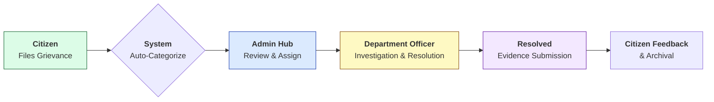

# CitizenCare — Smart Civic Grievance Platform


> [!IMPORTANT]
> **Hackathon Achievement**: This project was recognized as a **Runner-Up Project** in a prestigious civic-tech hackathon. It highlights the potential of modern full-stack technologies in solving real-world municipal challenges.

## 🌟 Overview

**CitizenCare** is a next-generation municipal grievance redressal system designed to eliminate the friction between citizens and local authorities. Developed as a comprehensive MERN (MongoDB, Express, React, Node) stack application, it provides a transparent, data-driven environment for reporting, tracking, and resolving community issues like infrastructure decay, sanitation problems, and public safety concerns.

The platform bridges the communication gap by utilizing geospatial intelligence and automated workflows, ensuring that every complaint is handled with accountability and precision.

---

## 🚀 Key Features

### 👤 Citizen Portal
- **Intuitive Reporting**: Simplified complaint filing with multi-media support (image/video uploads).
- **Live Tracking**: Real-time status updates and historical dossier of personal grievances.
- **Geotagging**: Automatic location capturing for precise incident reporting.

### 🏛️ Admin Command Center
- **Operational Oversight**: A high-performance dashboard featuring KPI tracking and resolution metrics.
- **Strategic Allocation**: Advanced tools to assign complaints to verified department officers.
- **Personnel Management**: Global control over department hierarchies and officer performance trust-scales.

### 👮 Officer Task Management
- **Field Intelligence**: Dedicated portal for officers to manage assigned tasks and mark progress.
- **Action Logs**: Comprehensive trail of investigation notes and resolution evidence.
- **Performance Meter**: Integrated tracking of resolution speed and quality.

### 🗺️ Geospatial Intelligence
- **Heatmaps**: Visual representation of grievance hotspots across the city.
- **Interactive Mapping**: Precision placement of reports using Leaflet.js and 2dsphere indexing for high-fidelity spatial queries.

---

## 🔄 Complaint Lifecycle



---

## 🏗️ System Architecture

CitizenCare follows a decoupled **Client-Server Architecture**:

- **Frontend**: A single-page application (SPA) built with React, utilizing a modular component design and Tailwind CSS for a premium, tactical UI.
- **Backend**: A RESTful API built on Node.js and Express, implementing JWT stateless authentication and Mongoose middleware for data integrity.
- **Database**: MongoDB Atlas for cloud-native persistence, leveraging Geospatial indexing for location-based features.

---

## 🛠️ Technology Stack

| Layer | Technology |
| :--- | :--- |
| **Frontend** | React 19, Vite, Tailwind CSS 4, Framer Motion, Lucide Icons |
| **Mapping** | Leaflet.js, React-Leaflet, Geospatial Indexing |
| **Backend** | Node.js, Express.js |
| **Database** | MongoDB, Mongoose |
| **Auth** | JSON Web Tokens (JWT), Bcrypt.js |
| **Storage** | Multer (Local/Buffer Storage for evidence) |
| **Analytics** | Chart.js, React-ChartJS-2 |

---

## 📸 Platform Screenshots

> Screenshots of the Citizen Dashboard, Admin Command Center, and Geospatial Map are located in the `/screenshots` directory.

<p align="center">
  
  
</p>

---

## ⚙️ Installation

### Prerequisites
- Node.js (v18 or higher)
- MongoDB Cluster (Atlas or Local)
- npm or yarn

### 1. Repository Setup
```bash
git clone https://github.com/Abhinay-12-k/Citizen-Care.git
cd Citizen-Care
```

### 2. Backend Setup
```bash
cd backend
npm install
```
Create a `.env` file in the `backend` directory:
```env
PORT=5000
MONGODB_URI=your_mongodb_connection_string
JWT_SECRET=your_super_secret_key
```
Start the server:
```bash
npm run dev
```

### 3. Frontend Setup
```bash
cd ../frontend
npm install
npm run dev
```

### 4. Seed Initial Data (Optional)
```bash
# From the project root
node seed.js
```

---

## 🔑 Demo Credentials

| Role | Email | Password |
| :--- | :--- | :--- |
| **Administrator** | `admin@city.gov` | `password123` |
| **Municipal Officer** | `john@pwd.gov` | `password123` |
| **Citizen** | `alex@gmail.com` | `password123` |

---

## 📖 Example Workflow

1. **Citizen** logs in and reports a "Pothole" via the reporting form, attaching a photo and pinning the location.
2. **System** tags the complaint with **High Priority** based on the category.
3. **Admin** views the new complaint in the Command Center and assigns it to **Officer John** (PWD Department).
4. **Officer John** receives the task, visits the site, repairs the pothole, and uploads a "Fixed" photo.
5. **Complaint Status** updates to "Resolved," and the Citizen receives a confirmation.

---

## 🔮 Future Enhancements

- [ ] **AI-Powered Categorization**: Using NLP to automatically categorize complaints from text descriptions.
- [ ] **Mobile Application**: Native Android/iOS versions via React Native.
- [ ] **WhatsApp Integration**: Allowing citizens to report issues directly through WhatsApp bots.
- [ ] **Blockchain Logging**: For immutable record-keeping of resolution history.

---

## 🤝 Contributing

Contributions are what make the open-source community such an amazing place to learn, inspire, and create. Any contributions you make are **greatly appreciated**.

1. Fork the Project
2. Create your Feature Branch (`git checkout -b feature/AmazingFeature`)
3. Commit your Changes (`git commit -m 'Add some AmazingFeature'`)
4. Push to the Branch (`git push origin feature/AmazingFeature`)
5. Open a Pull Request

---

## 📜 License

Distributed under the **MIT License**. See `LICENSE` for more information.

---

## 👨‍💻 Author

**Abhinay**
- GitHub: [@Abhinay-12-k](https://github.com/Abhinay-12-k)
- Project Link: [Citizen-Care](https://github.com/Abhinay-12-k/Citizen-Care)

---
<p align="center">Built with passion for a smarter, cleaner city.</p>
